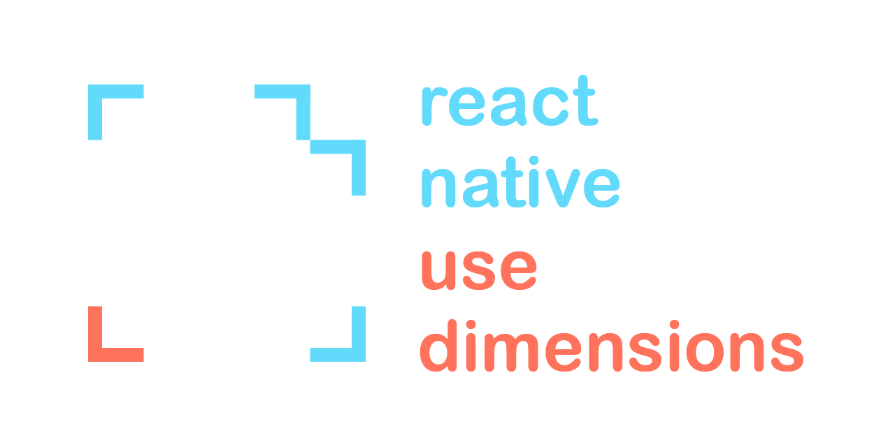

[](https://npmjs.org/package/react-native-use-dimensions)
[](https://npmjs.org/package/react-native-use-dimensions)
[](https://github.com/dawsonbooth/react-native-use-dimensions/actions?workflow=build)
[](https://github.com/dawsonbooth/react-native-use-dimensions/blob/master/LICENSE)

# Description

This Node.js package is a collection of React hooks for using the dimensions of the screen, window, or both.

# Installation

With [Node.js](https://nodejs.org/en/download/) installed, simply run the following command to add the package to your project.

```bash
npm install react-native-use-dimensions
```

# Usage

Check out the examples below or [check out the docs](https://dawsonbooth.github.io/react-native-use-dimensions/).

The package comes with three hooks:

1. **useScreenDimensions** - screen dimensions
2. **useWindowDimensions** - window dimensions, which can be [separate from screen on Android](https://stackoverflow.com/a/44979327/11960129)
3. **useDimensions** - screen and window dimensions

```js
import React from "react";
import { Text } from "react-native";
import useDimensions, {
    useScreenDimensions,
    useWindowDimensions
} from "react-native-use-dimensions";

const ScreenDimensions = () => {
    const { height, width } = useScreenDimensions();
    const isLandscape = width > height;
    return (
        <Text>
            {width}x{height}
            Orientation: {isLandscape ? "Landscape" : "Portrait"}
        </Text>
    );
};

const WindowDimensions = () => {
    const { height, width } = useWindowDimensions();
    const isLandscape = width > height;
    return (
        <Text>
            {width}x{height}
            Orientation: {isLandscape ? "Landscape" : "Portrait"}
        </Text>
    );
};

const BothDimensions = () => {
    const { screen, window } = useDimensions();
    return (
        <Text>
            Screen: {screen.width}x{screen.height}
            Window: {window.width}x{window.height}
        </Text>
    );
};
```

# License

This software is released under the terms of [MIT license](LICENSE).
